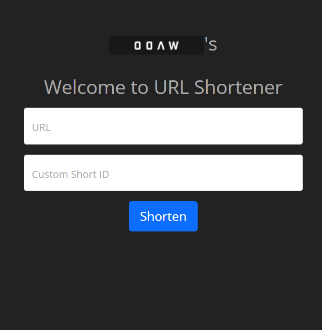

# URLShortener
A simple URL Shortening Service.

## Usage
The following command will install the packages according to the configuration file ```requirements.txt```.
```
$ pip install -r requirements.txt
```

After which, to configure your machine's environment variables with
```
SECRET_KEY=verysecretkey
DATABASE_URL=sqlite:///shorty.db
APP_SETTINGS=config.DevelopmentConfig
FLASK_APP=core
```

Note: While deploying, you may change the APP_SETTINGS to config.ProductionConfig.

To run the various test cases, use:
```
$ python -m pytest -v
```

Then run the URL client application, use:
```
$ flask run
```

## Demo
For a live demonstration of this URL shortening application, visit https://shorten-flask.herokuapp.com/.
